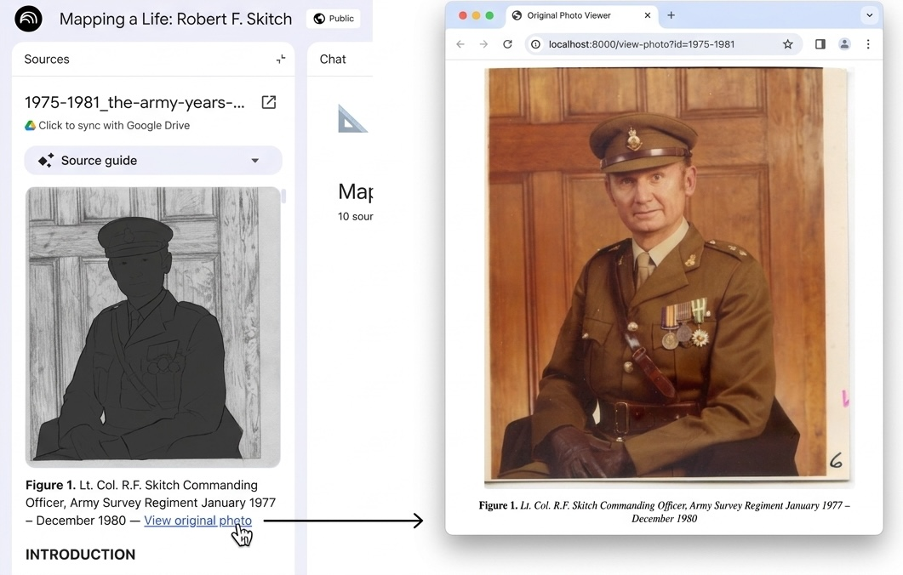
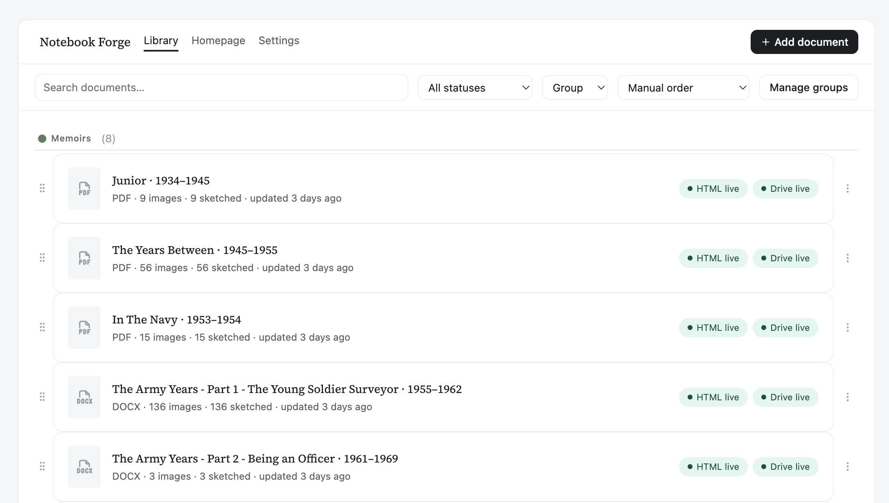
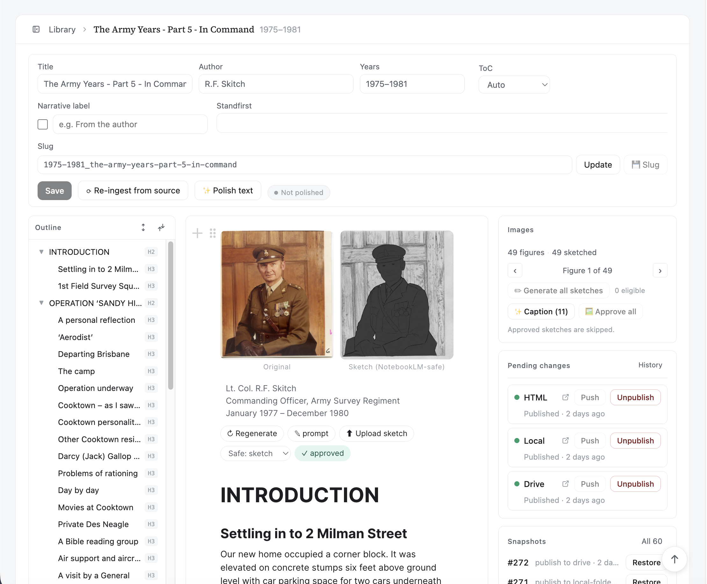

# Notebook Forge

**Prepare any photo‑rich document for [NotebookLM](https://notebooklm.google.com)
— so photographs of people actually survive ingestion and appear in the
generated slideshows, guides and answers, without publishing a single
recognisable face.**



> ### ℹ️ Why this tool is needed
>
> NotebookLM **silently strips images that contain identifiable people** during
> source ingestion — while images of objects and landscapes in the *same*
> document are ingested fine. Because those photos are removed before
> processing, they can never appear in NotebookLM's slideshows, guides or
> multimodal answers, which makes those features unusable for memoirs,
> biographies and historical documents about people.
>
> Notebook Forge's fix: it replaces each photo of a person with a **faceless
> sketch** that passes ingestion, and links that sketch back to the original
> photo hosted on your own site — so the people survive into the generated
> output while their faces are never published.
>
> See [**NOTEBOOKLM_IMAGE_ISSUE.md**](NOTEBOOKLM_IMAGE_ISSUE.md) for the full
> reproduction and a community bug report.

Notebook Forge is a local‑first content tool. You feed it the PDFs and Word
documents your content already lives in; it extracts the prose, photos, captions
and footnotes into an editable document, lets you clean it up in a Notion‑style
editor, and publishes to three synchronised targets at once:

- **A public website** (GitHub Pages) — the canonical, nicely typeset edition,
  which also **hosts the original photos** that the safe edition links back to.
- **A NotebookLM‑safe edition** (Google Drive) — every photograph is replaced
  by a faceless **sketch silhouette** and inlined into a Google Doc you can load
  straight into NotebookLM. Each caption keeps a "View original photo" link back
  to the live site.
- **A local folder** — a portable static mirror for rehearsal or offline use.

Everything is stored locally in SQLite. Nothing is sent anywhere except the
image model you choose to call and the targets you explicitly publish to.

### Example uses

- **Family memoirs and personal histories** — share Grandad's war memoir in
  NotebookLM with the photos intact, but faceless.
- **Genealogy and archival projects** — make a photo‑heavy family archive
  explorable without publishing relatives' faces.
- **Oral‑history and community‑history collections** — club, regiment, school or
  town histories full of named people.
- **Biographies and journalism** — long‑form documents whose subjects appear in
  photographs you don't want surfaced by a third‑party model.

## How it works

```
        ┌───────────────┐
        │  PDF / DOCX    │   your source document
        └───────┬────────┘
                │  INGEST  — headings · paragraphs · footnotes
                │            images (captions paired by page geometry)
                │            date-range detection · italic → narrative
                ▼
        ┌────────────────────────────┐
        │  BlockNote document tree    │   canonical copy in SQLite
        │  + content-addressed images │   (WAL · JSON blocks · FTS5 search)
        └───────────────┬────────────┘
                        │  EDIT  — prose polish · figure sketches · captions
                        │          narrative panels · footnotes · structure
                        ▼
        ┌────────────────────────────┐
        │   Notion-style editor       │
        └───────────────┬────────────┘
                        │  PUBLISH  — one click, three synchronised targets
        ┌───────────────┼───────────────────────────┐
        ▼               ▼                            ▼
┌───────────────┐ ┌────────────────────┐ ┌────────────────────┐
│ GitHub Pages  │ │ Google Drive       │ │ Local folder       │
│ public website│ │ NotebookLM-safe    │ │ static mirror /    │
│               │ │ (faceless sketches)│ │ rehearsal copy     │
└───────────────┘ └────────────────────┘ └────────────────────┘
```

## Screenshots

The **Library** — your corpus with a live publish‑status badge per target,
full‑text search, grouping, and one‑click ingest:



The **editor** — each figure shows the original photo beside its
NotebookLM‑safe sketch; the right rail carries the figure tools, publish
targets and snapshot history; the left rail is a live document outline:



## Features

### Library & ingestion

- **Add a document** — drop in a **PDF or DOCX**. Ingestion extracts headings,
  paragraphs and footnotes, pairs each photo with its caption by page
  geometry, detects the date range, and converts fully‑italic passages into
  narrative panels.
- **Live status** — every document shows a coloured badge per target
  (live / changes to push / never published).
- **Full‑text search** across the whole corpus (SQLite FTS5).
- **Groups** — collect documents into coloured, manually‑orderable groups.
- **Re‑ingest from source** — re‑run extraction on an updated PDF/DOCX while
  **preserving your figure work** (sketches, captions, approvals).

### The editor

A BlockNote (Notion‑style) editor with custom blocks built for long,
photo‑rich documents.

- **Figures (`forgeImage`)** — the original photo and its NotebookLM‑safe
  sketch side by side. Per figure you can:
  - **Generate / Regenerate** a faceless sketch (Gemini image model behind a
    **face gate** — sketches with detected faces are retried or blocked).
  - **Upload your own sketch** when the model declines a particular photo.
  - Set a **per‑figure prompt** override.
  - Choose what the safe edition embeds — **Safe: sketch / original / omit**.
  - **Auto‑caption** from the image, and **approve** sketches before publish.
- **Batch figure tools** — *Generate all sketches* (skips already‑approved and
  Safe: original/omit figures), *Caption images*, *Approve all*, and a
  step‑through reviewer for any face‑flagged sketches.
- **Footnotes (`forgeFootnote`)** — co‑located asides. Insert with `/footnote`,
  remove from the block itself, and footnotes **renumber automatically**.
- **Narrative panels (`forgeNarrative`)** — a warm‑tinted block for the
  author's reflective voice. Insert via `/narrative`, or convert any paragraph
  to/from narrative from the drag‑handle menu. Optional small‑caps label
  (e.g. "From the author").
- **Text polish** — a mechanical clean‑up pass (typography, whitespace, obvious
  typos) that **auto‑applies safe fixes and holds every word‑level change for
  your review** with an inline diff. A snapshot is taken first so the whole
  pass can be undone.
- **Outline navigator** — a live heading tree for jumping around long
  documents.
- **Snapshots** — publish/edit history with one‑click restore.
- **Resilient by design** — body edits autosave; an error boundary keeps a
  single misbehaving block from blanking the editor.

### Publishing

One **Push** sends a document to any or all targets; the panel shows per‑target
state, "N changes behind", and a link to open the published output.

- **GitHub Pages** — the live site in a clean typeset house style, with the
  collection index, sitemap, `robots.txt` and `llms.txt` regenerated on every
  publish.
- **Google Drive** — the NotebookLM‑safe edition per document (faceless
  sketches inlined as a Google Doc; captions link back to the originals).
- **Local folder** — a static mirror of the site for rehearsal or offline use.

### Homepage & collection index

The **Homepage** is itself a first‑class document in the Library. It carries a
`forgeDocGroup` block per group — a live, sortable member list you arrange right
in the editor. Publishing it regenerates the collection‑index pages on every
target.

### Settings

Workspace‑wide configuration: sketch model & silhouette prompt, face‑gate
policy, text‑polish model & rules, the optional narrative label, the
**footer / licence** notice printed on every published page and Google Doc,
and connection status for each secret.

## Requirements

- **macOS** (secrets are stored in the macOS Keychain).
- **Python 3.12** and [**uv**](https://docs.astral.sh/uv/) (Python package
  manager).
- **Node.js 20.19+** (or 22.12+) and **npm**.
- A **Google Gemini API key** for sketch generation (optional — you can also
  upload your own sketches). For publishing: a GitHub fine‑grained token
  (Pages) and Google Drive OAuth (NotebookLM edition).

## Install

```sh
git clone https://github.com/hold-shift/notebook-forge.git
cd notebook-forge

# Backend (Python) and frontend (Node) dependencies
cd backend && uv sync && cd ../frontend && npm install && cd ..
```

## Run

```sh
make dev      # backend on :8400, frontend on :5173
```

Then open **http://localhost:5173**.

```sh
make check    # ruff + pytest + tsc + vitest (run before committing)
```

By default the workspace (database, image assets, sketch cache, exports) lives
at `~/NotebookForge-workspace/`. Override with the `NOTEBOOK_FORGE_WORKSPACE`
environment variable.

## First steps

1. Start the app (`make dev`) and open the Library.
2. Click **+ Add document** and choose a PDF or DOCX. Confirm the detected
   title and date range in the editor's meta bar.
3. Add a **Gemini API key** (see *Configuration*) and click
   **Generate all sketches**, or upload your own sketches per figure.
4. Optionally run **Polish text** and review the flagged changes.
5. Configure a target and **Push** — open the published output from the panel.

## Configuration

Secrets live in the **macOS Keychain** under the service `notebook-forge` —
never written to the database, config, logs, or git.

| Secret | Purpose | How to set |
|---|---|---|
| `gemini-api-key` | Sketch generation | `uv run keyring set notebook-forge gemini-api-key` |
| `github-pat` | GitHub Pages publishing (fine‑grained, Contents read/write) | `uv run keyring set notebook-forge github-pat` |
| `drive-oauth-token` | Google Drive (NotebookLM edition) | `uv run python -m notebook_forge.cli drive-auth --secrets secret/<client>.json` |

All three are optional — the editor works fully without any of them; you just
won't be able to generate sketches or publish to that target.

## Project layout

```
backend/    Python 3.12 · FastAPI · SQLAlchemy 2 · SQLite (WAL, JSON, FTS5)
            notebook_forge/ingest_vendor/  — the PDF/DOCX extraction pipeline
frontend/   Vite · React · TypeScript · BlockNote (core/react/mantine)
scripts/    helper scripts
secret/     OAuth client secrets (gitignored, never committed)
```

The workspace directory (content, assets, exports) is kept **outside** the
repository.

## Licence

Code: **MIT** (see [LICENSE](LICENSE)).

Memoir content and photographs are **not** part of this repository — they
belong to their authors. The example site publishes under CC BY‑NC‑ND.
